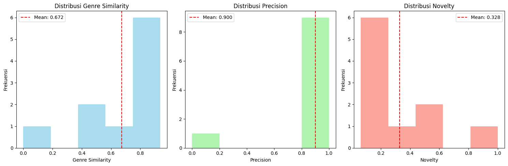

# 📚 Sistem Rekomendasi Light Novel Isekai
### Content-Based Filtering dengan TF-IDF & Cosine Similarity

<div align="center">


<br/>

**Proyek Akhir Kelas Machine Learning Terapan — Dicoding**

*oleh Silmi Azdkiatul Athqia (silmiathqia)*

</div>

> Sistem rekomendasi otomatis untuk membantu pembaca menemukan light novel isekai yang relevan berdasarkan preferensi bacaan mereka — mengatasi *information overload* dari ribuan judul yang tersedia.

---

## 📋 Project Overview

Light novel genre isekai mengalami pertumbuhan pesat dengan ribuan judul yang tersedia di berbagai platform. Pembaca sering mengalami kesulitan menemukan novel yang sesuai preferensi mereka — fenomena *information overload* yang menciptakan kebutuhan akan sistem rekomendasi yang personal dan akurat.

Proyek ini mengimplementasikan **Content-Based Filtering** menggunakan **TF-IDF Vectorization** dan **Cosine Similarity** untuk merekomendasikan light novel berdasarkan kesamaan konten (deskripsi, genre, dan judul).

---

## 📊 Dataset

**Isekai Light Novel Titles and Descriptions**

| Info | Detail |
|---|---|
| Sumber | [Kaggle - Isekai Light Novel Dataset](https://www.kaggle.com/datasets/andy8744/isekai-light-novel-titles-and-descriptions) |
| Jumlah Novel | 1.366 judul |
| Genre Unik | 25 genre |
| Genre Dominan | Fantasy (1.311 novel / 96%) |
| Rata-rata Deskripsi | 664 karakter |
| Missing Values | ✅ Tidak ada |

### Fitur Dataset

| Fitur | Tipe | Deskripsi |
|---|---|---|
| `titles` | object | Judul lengkap light novel |
| `descriptions` | object | Sinopsis/deskripsi novel |
| `genres` | object | Genre dalam format list |
| `links` | object | URL referensi sumber |

---

## 🧠 Metodologi

### Pipeline Sistem Rekomendasi

```
Raw Data (1.366 novel)
    │
    ▼
Text Preprocessing
(lowercase, remove special chars)
    │
    ▼
Genre Processing
(parse list → string)
    │
    ▼
Feature Engineering
(combine descriptions + genres + titles)
    │
    ▼
TF-IDF Vectorization
(5000 fitur, max_features=5000)
    │
    ▼
Cosine Similarity Matrix
(1366 × 1366)
    │
    ▼
Top-N Recommendations ✅
```

### Algoritma

**TF-IDF (Term Frequency-Inverse Document Frequency)**
- Mengekstrak fitur tekstual dari combined features
- 5000 dimensi fitur
- Sparsity: 98.92% (optimal memory usage)

**Cosine Similarity**
- Mengukur kesamaan antar novel berdasarkan sudut vektor
- Nilai 0–1 (1 = identik, 0 = tidak ada kesamaan)
- Matrix similarity 1366×1366

---

## 📈 Hasil Evaluasi

### Metrik Evaluasi

| Metrik | Formula | Hasil |
|---|---|---|
| **Genre Similarity** | Jaccard Similarity | **0.6722** (67.22%) |
| **Precision@K** | Relevant / K | **0.9000** (90.00%) |
| **Novelty Score** | 1 - Avg Genre Similarity | **0.3278** (32.78%) |

### Analisis Hasil

- **Precision 90%** — 9 dari 10 rekomendasi memiliki genre yang relevan
- **Genre Similarity 67.22%** — model berhasil menemukan novel dengan konten serupa
- **Novelty 32.78%** — keseimbangan baik antara relevansi dan kebaruan, menghindari *filter bubble*



---

## 🔍 Contoh Rekomendasi

**Input:** `"Full Metal Panic!"`

| Rank | Judul | Similarity | Genre |
|---|---|---|---|
| 1 | Shinka no Mi | 0.2216 | Action, Adventure, Fantasy, Harem |
| 2 | An Illustrated Guidebook to Other Races | 0.2160 | Action, Adventure, Fantasy, Harem |

---

## 📂 Struktur Project

```
Sistem_Rekomendasi/
├── 📓 Sistem_Rekomendasi_Notebook.ipynb   # Notebook utama
├── 🐍 sistem_rekomendasi_notebook.py      # Script Python
├── 📄 laporan_submission_2.md             # Laporan proyek
├── 📊 light-novel-titles.csv              # Dataset
└── 📁 images/
    ├── distribusi_genre.png               # Visualisasi genre
    ├── panjang_deskripsi.png              # Analisis deskripsi
    └── hasil_evaluasi.png                 # Plot evaluasi
```

---

## ✅ Kelebihan & Keterbatasan

**Kelebihan:**
- Tidak memerlukan data historis pengguna
- Dapat merekomendasikan item baru (*cold start* friendly)
- Transparan dalam alasan rekomendasi
- Response time < 1 detik
- Coverage 100% novel dapat direkomendasikan

**Keterbatasan:**
- Terbatas pada fitur konten yang tersedia
- Tidak menangkap preferensi pengguna yang dinamis
- Berpotensi menghasilkan rekomendasi yang terlalu mirip

---

## 🎓 Sertifikat

<div align="center">

> 🏅 **Machine Learning Terapan** — Dicoding Indonesia
>
> Diperoleh oleh **Silmi Azdkiatul Athqia**

[](https://www.dicoding.com/certificates/1RXYEGV2QZVM)

</div>

---

## 📚 Referensi

- Ricci, F., Rokach, L., & Shapira, B. (2015). *Recommender Systems Handbook*. Springer.
- Isinkaye, F. O., et al. (2015). Recommendation systems: Principles, methods and evaluation. *Egyptian Informatics Journal*, 16(3), 261-273.
- Dataset: [Kaggle - Isekai Light Novel Titles and Descriptions](https://www.kaggle.com/datasets/andy8744/isekai-light-novel-titles-and-descriptions)

---

## 👩‍💻 Author

<div align="center">

**Silmi Azdkiatul Athqia**

[](https://www.dicoding.com/users/silmiathqia)
[](https://github.com/silmiaathqia)

🎓 Laskar AI 2025 Cohort — Mahasiswa & Fresh Graduate

</div>

---

<div align="center">
<i>Proyek Akhir — Machine Learning Terapan — Dicoding 2025</i>
<br/>
<sub>Made with ❤️ by Silmi Azdkiatul Athqia</sub>
</div>
